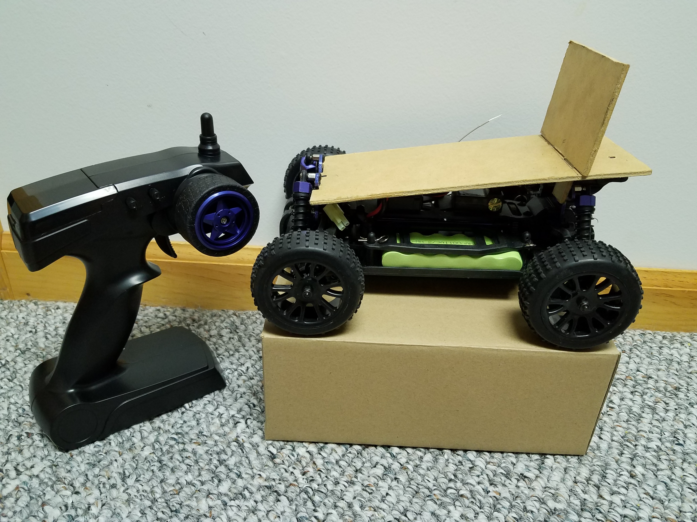
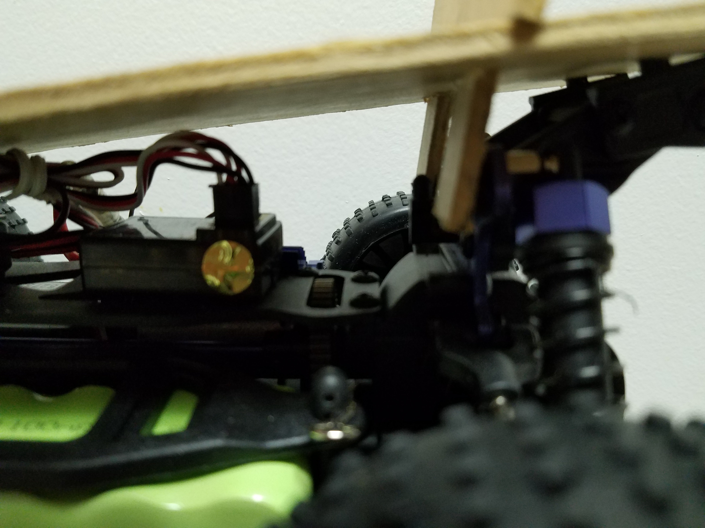
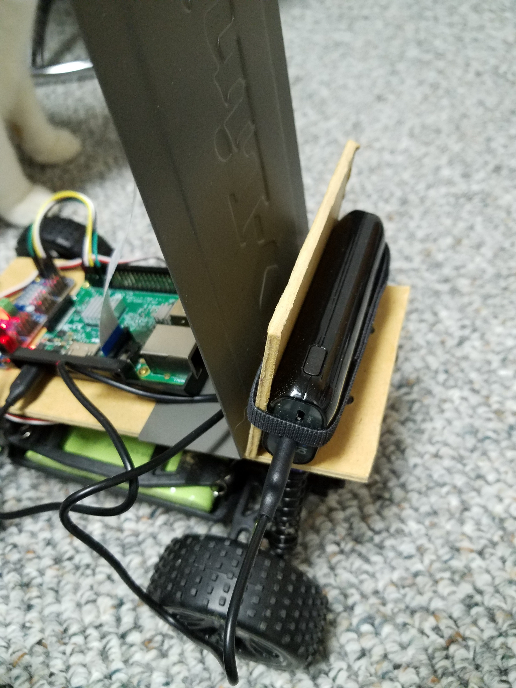

## Purpose:

This is to document the ongoing progress of building and training an RC car to drive itself using the open source Donkeycar platform. The Donkeycar repo is located [here](https://github.com/wroscoe/donkey).

## Origin: 

I originally wanted to start this project for 2 reasons.
- I have always been interested in robotics, so I felt this would be a great project to experiment with.

- I really enjoyed the behavioral cloning project I completed as part of my Udacity nanodegree program, and thought it would
be cool to work with the same theory on a tangible project. My behavioral cloning project can be found [here](https://github.com/DavidG1011/Udacity-Behavioral-Cloning---P3).

## Electronic Parts:

- 1/16 2.4Ghz Exceed RC Blaze.
- Raspberry Pi 3 Model B.
- SunFounder PCA9685 16 Channel 12 Bit PWM Servo Driver.
- SainSmart Wide Angle Fish-Eye RPi Camera.
- Maxmoral 10cm Dupont Female to Female Jumper Wire.
- 6700mAh Anker Astro E1 Power Bank.

## Structural Parts:

- Masonite.
- Velcro Cable Ties.
- Shell cover from D-Link KVM switch.
- RC car chassis.

## General Behavior Theory:

- Car driven manually to record desired behavior for the vehicle.
- Images and actuator values synced to more powerful system for training model. 
- Images and actuator values used to train a model for inferencing.
- Model is synced back to Raspberry Pi.
- Model is used to inference frames from camera for autonomous operation. 

## Specific System Functionality And Design:

- 1/16 2.4Ghz Exceed RC Blaze: The basis for the whole project. This model of RC car was specifically picked due to it having a separable reciever and ESC (Electronic Speed Control).  This means that it's easy to bypass the reciever, so it can be controlled by other means. 

- Raspberry Pi 3 Model B: The brain for the RC car. Handles: sending signals for actuation, recording behavior during manual operation, transfering images, inferencing for autonomous operation.

- SunFounder PCA9685 16 Channel 12 Bit PWM Servo Driver: Recieves commands from the Raspberry Pi. Handles actuation of the RC car motor and steering servo.

- SainSmart Wide Angle Fish-Eye RPi Camera: Eyes of the system. Connects to the Raspberry Pi. Records images to use for model training, as well as observing car postion for autonomous inferencing. The wide angle lens provides sufficient coverage of the driving surface.  

- Maxmoral 10cm Dupont Female to Female Jumper Wire: Connects the Raspberry Pi to the servo driver to provide power and actuation commands. 

- 6700mAh Anker Astro E1 Power Bank: Used to power the Raspberry Pi, and by extention, the servo driver. 

## The Journey:

### Prototyping Structure:
First, the car chassis needed to be modified so that the components needed would fit on the car. The first design was simple, just a piece of masonite fitted over the existing pegs on the chassis that held the original car shell. A backboard was also added for fitting the camera, but this was ultimately too small to see the entire driving surface. 

The backboard was going to be screwed onto the suspension for stability, but a friction-fit was deemed to do the job just fine.

### Prototyping Electrical Components:
Next, the electronics needed to be prototyped. The pieces were placed in a general location to see where they might fit best. 
It's alive!

The wood underneath is to keep the car from running away while testing the motor. 

### Redesign:
At this point, I realized that the backboard was far too small to mount that camera on. This prompted a slight modification to the car. The electronic components were also mounted onto the masonite. 

This modification meant that the camera was high up enough to see plenty of the driving surface. This handy new camera mount is the shell cover from a D-Link KVM switch. Waste not, want not. 

The old camera mount was repurposed into a power bank mount. I could take out the old camera mount and just strap the power bank to the new one, but I didn't want the extra weight on it to cause camera shake. 

Now, I know this design won't win me any awards, but it's functional. The main focus of this project is functionality.

### Track Design:
If you build it, they will come...

The track design is simple. I wanted a single-line lane marker with high-contrast against the floor it was on. I chose red, as the floor is light gray. The images are gray scaled before training and inferencing, but this contrast will still be retained. 

This is simply red ribbon taped with masking tape.

### Track Redesign...:
The track was a little too small on the corners. The car has a poor turning radius, which unfortunately made it hard to stay within the track on turns. I widened the track on the corners to make it easier to stay within the lines. 

### Training Woes: 
Inherently, behavior cloning produces a model that can only be as good as the training data put into it. This meant that the RC car had to be manually driven for 10 - 15 laps around the track as perfectly as possible to get sufficient training data. Now, this presented a problem, as my RC skills aren't what you would call.."good". This meant I had to practice a lot, recharge the car's battery for a few hours, then try again. Eventually after a couple days worth of effort, and about 15 different models, I finally had one sufficient enough to navigate my car to some degree of success. This model can be seen in a video located [here](https://github.com/DavidG1011/Behavioral-Cloning-RC-Car-Project/blob/master/Videos/1.mp4) (will have to be viewed raw).

### Future Changes And Ideas:
- Further improvement of the training process to produce better results. The Donkeycar platform does not currently restrict the size of the image, so it is training on data that's not useful to navigation. Image flipping; images and steering angles can be flipped to increase the amount of training data available without recording more. This method is used in my behavioral cloning project for Udacity. 

- Train traffic sign behavior for more complex automation. This goal of course comes after improving general track behavior. 

- Perhaps explore areas of automation other than behavioral cloning. Might be hard to do with the low power of the Raspberry Pi.
